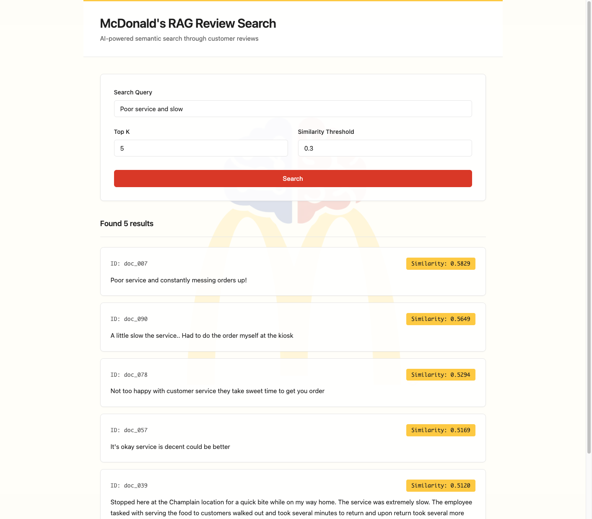
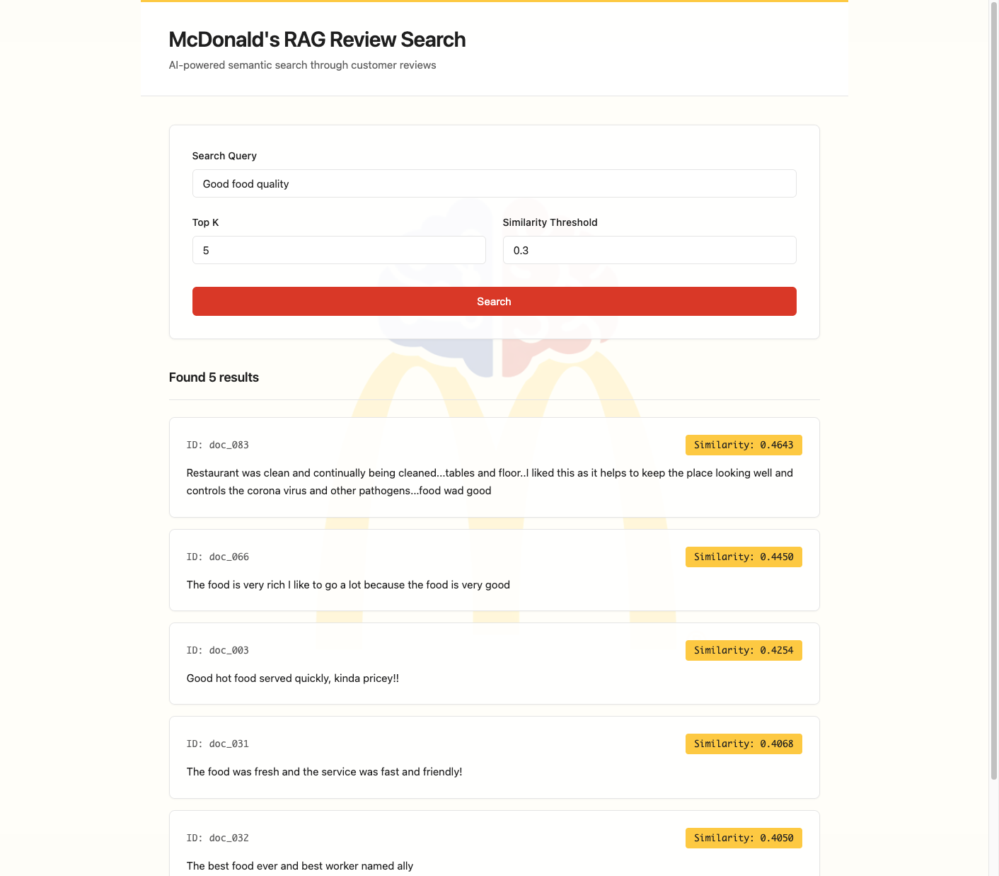
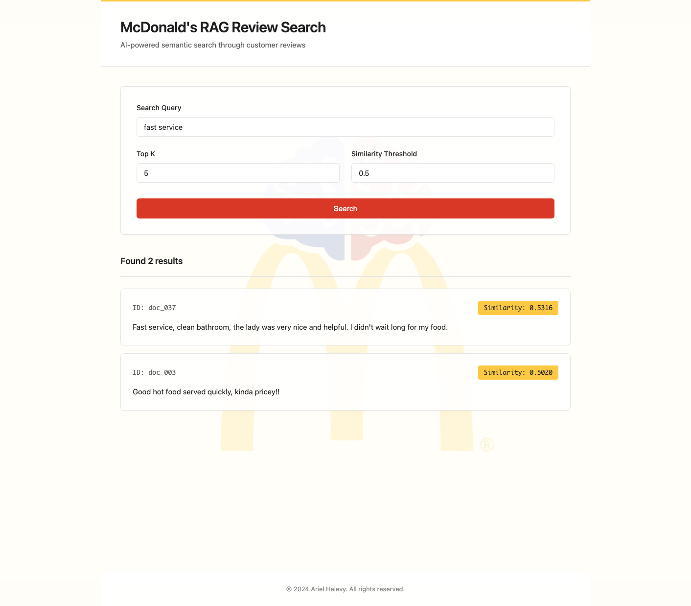
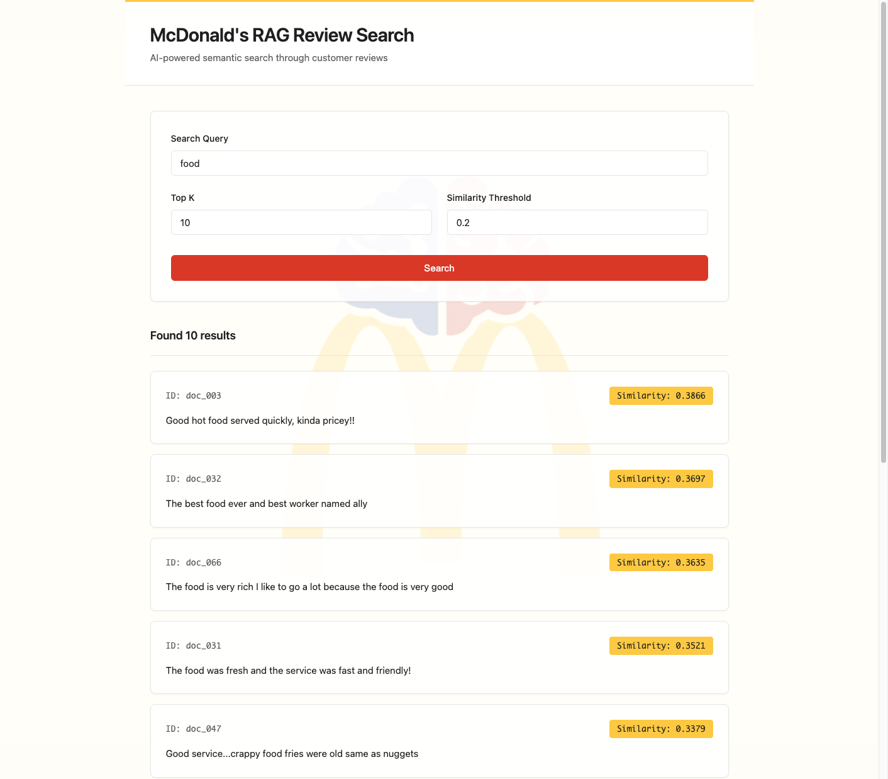
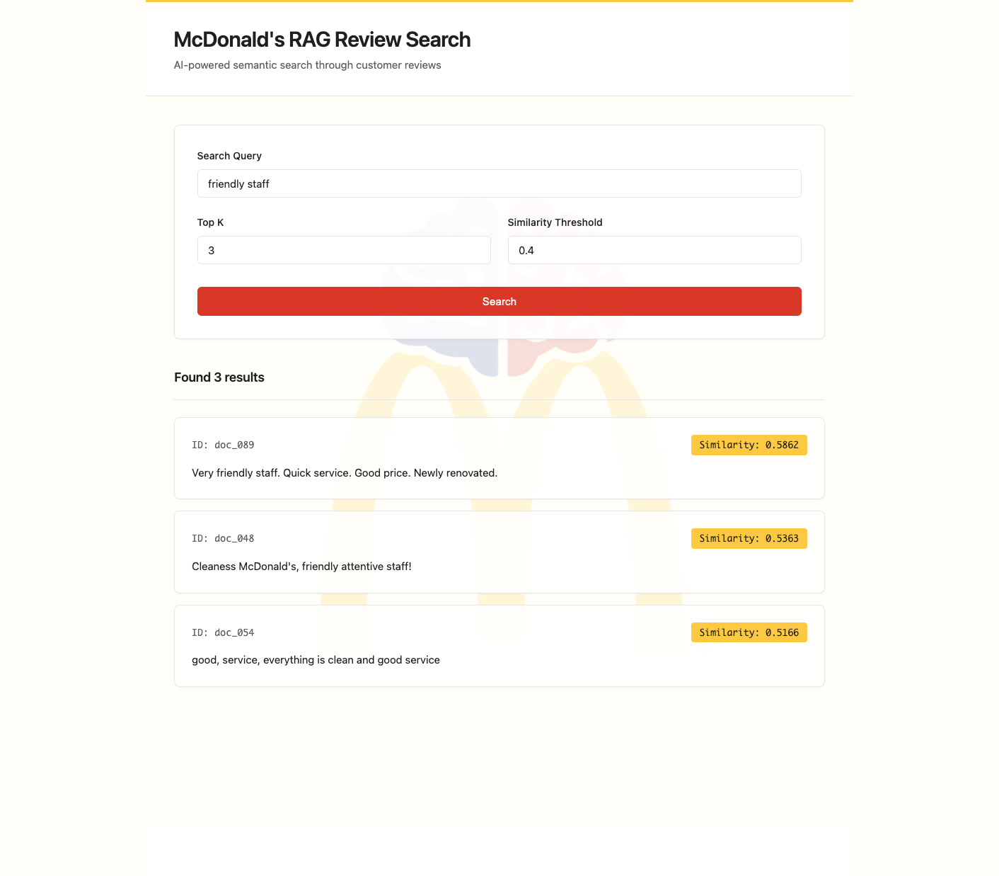

# Retrieval-only RAG System

A production-quality retrieval-only RAG (Retrieval-Augmented Generation) system that performs semantic search over McDonald's store reviews. This system implements **only the retrieval component** - no LLM generation, no chatbot responses, no summarization. The UI displays retrieved context chunks with similarity scores.

## Overview

This project demonstrates a complete retrieval-only RAG pipeline:
- **Ingestion**: Documents are embedded using OpenAI's `text-embedding-3-small` model and stored in a local Chroma vector database
- **Retrieval**: User queries are embedded and matched against document embeddings using cosine similarity. The system uses over-fetching and re-ranking to improve recall by compensating for ANN approximation
- **Display**: Retrieved chunks are displayed with similarity scores, filtered by a configurable threshold

## Dataset

**Source**: McDonald's Store Reviews from Kaggle (original dataset is large)

**Sampling**: This project uses ~100 reviews sampled from the original dataset to:
- Stay under cost constraints (embedding costs)
- Focus on retrieval quality demonstration
- Provide a manageable dataset for assignment purposes

Each review is treated as a single document chunk (see Design Decisions for rationale).

## Why This Dataset

This dataset was chosen because customer reviews are a natural fit for
semantic search and retrieval tasks. Reviews are unstructured, written in
natural language, and cover a wide range of topics such as service quality,
food quality, cleanliness, pricing, and overall experience.

Using McDonald's store reviews allows the system to demonstrate meaningful
semantic retrieval over real-world user-generated content, where relevant
information is not always expressed using the same keywords.

Additionally, the dataset size was intentionally kept small (~15,000 characters,
~100 reviews) to stay within assignment constraints, control embedding costs,
and focus on retrieval quality rather than scale.

## Setup

### Prerequisites

- Python 3.11+
- OpenAI API key

### Installation

1. **Create a virtual environment**:
   ```bash
   python -m venv rag_env
   source rag_env/bin/activate  # On Windows: rag_env\Scripts\activate
   ```

2. **Install dependencies**:
   ```bash
   pip install -r backend/requirements.txt
   ```

3. **Configure environment**:
   ```bash
   cp .env.example .env
   # Edit .env and add your OPENAI_API_KEY
   ```

## Ingestion

Before running the search system, you need to ingest documents into Chroma:

```bash
python scripts/ingest.py
```

This script:
- Reads documents from `data/documents.jsonl`
- Creates embeddings using OpenAI's `text-embedding-3-small` model
- Creates a Chroma collection with cosine distance metric (`hnsw:space="cosine"`)
- Stores embeddings in the local Chroma database at `chroma_db/`
- Skips documents that are already ingested (idempotent)

**Note**: The first run will create embeddings for all documents. Subsequent runs will only process new documents. The collection is configured with cosine distance to match the cosine similarity computation used during retrieval.

## Running the Application

1. **Start the FastAPI server**:
   ```bash
   uvicorn backend.app:app --reload
   ```

2. **Open the UI**:
   Navigate to `http://localhost:8000` in your browser

3. **Search**:
   - Enter a query in the search box
   - Optionally adjust `top_k` (number of candidates) and `similarity_threshold`
   - Click "Search" to retrieve relevant document chunks

## Design Decisions

### Chunking Strategy

**Decision**: Each review is treated as a single chunk (no further splitting).

**Rationale**:
- Reviews are naturally short (typically <500 words)
- Reviews are self-contained semantic units
- Splitting would fragment sentiment and context
- This is a deliberate design choice for this dataset

### Why Chroma

Chroma was chosen as the vector database for this project due to its simplicity,
lightweight nature, and suitability for local, retrieval-focused systems.

For the scope of this assignment, Chroma provides:
- **Local persistence** without requiring external services or credentials
- **Easy setup** and minimal configuration
- **Fast iteration** during development and testing
- **Clear API** for storing and querying embeddings

Using a local Chroma database allows the system to operate entirely on the local
machine after ingestion, with no dependency on external vector database services.
This keeps the focus on retrieval logic, similarity scoring, and system design
rather than infrastructure setup.

**Configuration**: The Chroma collection is configured to use **cosine distance** (`hnsw:space="cosine"`) for the HNSW index, which aligns with the cosine similarity computation used in the retrieval logic. The collection persists across server restarts and is only recreated if the distance metric configuration needs to change.

**Trade-off**: Chroma is best suited for small to medium datasets and local use.
For large-scale or production systems, a managed cloud vector database (e.g.
Pinecone, Weaviate, or Milvus) would be more appropriate.

### Similarity Scoring

**Decision**: Exact cosine similarity computed directly from embeddings for all candidates

**Implementation**: 
Since OpenAI embeddings are normalized (unit vectors), cosine similarity simplifies to the dot product:
```python
cosine_similarity = np.dot(query_emb, doc_emb)  # dot product = cosine for normalized vectors
```

The system computes exact cosine similarity for all fetched candidates (top_k + 10, max 60) to enable accurate re-ranking, ensuring the true top-k most similar results are returned.

**Why Cosine Similarity and Not Other Metrics?**

Cosine similarity was chosen over alternative distance metrics (Euclidean distance, Manhattan distance, dot product) for several key reasons:

1. **Direction over Magnitude**: Cosine similarity measures the angle between vectors, focusing on semantic direction rather than magnitude. This is ideal for embeddings where the meaning is encoded in the vector direction, not its length. Two documents can be semantically similar even if one is longer (has a larger magnitude).

2. **Normalized Embeddings**: OpenAI's `text-embedding-3-small` produces normalized embeddings (unit vectors). For normalized vectors:
   - Cosine similarity = dot product (since norms are 1)
   - Euclidean distance becomes less informative (all vectors have the same length)
   - Cosine similarity provides a bounded, interpretable measure [0, 1]

3. **Semantic Interpretation**: 
   - `1.0` = identical semantic meaning (vectors point in same direction)
   - `0.0` = orthogonal/uncorrelated (no semantic relationship)
   - Negative values = opposite meanings (rare with normalized embeddings)
   - This interpretation is more intuitive than distance metrics where smaller values mean "closer"

4. **Robustness to Document Length**: Reviews vary in length, but cosine similarity treats all vectors as unit vectors, making it robust to length differences. Euclidean distance would penalize longer documents even if they're semantically similar.

5. **Standard Practice**: Cosine similarity is the de facto standard for semantic search with embeddings, used by most production RAG systems and vector databases.

**Why Not Euclidean Distance?**
- Euclidean distance measures magnitude differences, which is less relevant for semantic similarity
- With normalized embeddings, all vectors have similar magnitudes, making Euclidean distance less discriminative
- Distance values are unbounded and less interpretable (what does "distance 0.5" mean?)

**Why Not Dot Product?**
- For normalized embeddings, dot product equals cosine similarity, so they're equivalent
- However, cosine similarity is more explicit about its normalization and more interpretable conceptually
- If embeddings weren't normalized, dot product would be biased toward longer documents

**Rationale Summary**:
- Provides true semantic similarity measure (not a distance-based heuristic)
- Bounded [0, 1] for normalized embeddings (OpenAI embeddings are normalized)
- More interpretable than distance-based measures
- Directly interpretable: 1.0 = identical, 0.0 = orthogonal
- Robust to document length variations

### Threshold Semantics

**Decision**: `similarity_threshold` filters results where cosine similarity >= threshold

**Interpretation**:
- **Lower threshold (0.2-0.3)**: More permissive, returns more results (higher recall)
- **Higher threshold (0.5+)**: Stricter relevance, returns fewer results (higher precision)
- **Default 0.3**: Balances recall and precision

**Cosine similarity values**:
- `1.0`: Identical semantic meaning
- `0.7-0.9`: Very similar
- `0.5-0.7`: Moderately similar
- `0.3-0.5`: Somewhat related
- `0.0-0.3`: Weakly related or orthogonal

### Query-time Embeddings

**Decision**: Query embeddings are created at runtime using the same model as documents

**Rationale**:
- **Necessary for semantic search**: The query must be embedded using the same model as documents to enable vector similarity search
- **Standard RAG pattern**: This is how retrieval works in production RAG systems
- **Distinct from ingestion**: Ingestion-time embeddings (documents) are created once and stored; query-time embeddings are created on-demand

### Retrieval Optimization: Over-fetching and Re-ranking

**Decision**: The system fetches more candidates than requested (`top_k + 10`, max 60) and re-ranks them using exact cosine similarity

**Implementation**:
- Chroma is queried with `n_results = min(top_k + 10, 60)` to retrieve more candidates than the user requests
- Exact cosine similarity is computed on all returned embeddings (compensating for ANN approximation)
- Candidates are re-ranked by exact similarity score (not ANN approximations)
- Results are filtered by threshold and limited to the original `top_k` request

**Rationale**:
- **Better Recall**: Over-fetching compensates for approximate nearest neighbor (ANN) search approximation errors. Chroma uses ANN algorithms (e.g., HNSW) which may miss some truly similar vectors in the exact top-k
- **Accurate Ranking**: Computing exact cosine similarity ensures results are ordered by true similarity, not ANN approximations
- **Application-layer Control**: Full control over ranking, thresholds, and filtering remains in the application layer
- **Minimal Overhead**: Only 10 extra candidates are fetched (capped at 60), providing significant accuracy improvements with minimal computational cost

This is a standard production technique used in many RAG systems to improve retrieval accuracy.

### Top K Parameter

**Decision**: `top_k` specifies the number of results to return (max 50)

**Behavior**:
- The system internally fetches `top_k + 10` candidates (max 60) from Chroma
- Exact cosine similarity is computed and candidates are re-ranked
- Results are filtered by threshold and limited to `top_k` for the final response
- Higher `top_k`: More results returned (up to 50)
- Lower `top_k`: Fewer results, but still benefits from over-fetching optimization

## Evaluation Criteria

When assessing retrieval quality, consider:

1. **Relevance**: Retrieved chunks should be semantically related to the query (not just keyword matches)
2. **Ranking**: Most similar results should appear first (sorted by similarity descending)
3. **Threshold behavior**: Results above threshold should be meaningfully related; below threshold should be less relevant
4. **Coverage**: For diverse queries, the system should retrieve relevant reviews across different topics/sentiments
5. **No false positives**: Avoid returning completely unrelated reviews

## Example Queries

Here are 5 example queries to test the system:

### 1. "Poor service and slow"
**Expected**: Reviews mentioning bad service, slow service, or customer service issues
**Evaluation**: Should return reviews with complaints about service quality, wait times, or staff behavior

### 2. "Good food quality"
**Expected**: Positive reviews about food taste, quality, or freshness
**Evaluation**: Should return reviews praising food, with similarity scores typically >0.4

### 3. "Fast service" (High Threshold: 0.5, Top K: 5)
**Expected**: Reviews about fast service with strict filtering
**Evaluation**: Demonstrates high similarity threshold (0.5) filtering to return only highly relevant results

### 4. "Food" (Low Threshold: 0.2, Top K: 10)
**Expected**: Broad food-related reviews with permissive filtering
**Evaluation**: Demonstrates low similarity threshold (0.2) and higher top_k (10) to retrieve more results with broader relevance

### 5. "Friendly staff" (Medium Threshold: 0.4, Top K: 3)
**Expected**: Reviews about friendly staff with balanced filtering
**Evaluation**: Demonstrates medium similarity threshold (0.4) and lower top_k (3) to return fewer but highly relevant results

## Screenshots

Below are screenshots demonstrating the system in action for each of the 5 example scenarios:

### Scenario 1: "Poor service and slow"


This query successfully retrieves reviews complaining about service quality, slow service, and order issues. The system returns 5 results with similarity scores ranging from 0.5120 to 0.5829, showing relevant reviews about poor service experiences.

**Key Results:**
- `doc_007`: "Poor service and constantly messing orders up!" (Similarity: 0.5829)
- `doc_090`: "A little slow the service.. Had to do the order myself at the kiosk" (Similarity: 0.5649)
- `doc_078`: "Not too happy with customer service they take sweet time to get you order" (Similarity: 0.5294)

### Scenario 2: "Good food quality"


This query retrieves positive reviews about food taste, quality, and freshness. The system returns 5 results with similarity scores ranging from 0.4050 to 0.4643, demonstrating semantic understanding of food quality discussions.

**Key Results:**
- `doc_083`: Review mentioning "food wad good" along with cleanliness (Similarity: 0.4643)
- `doc_066`: "The food is very rich I like to go a lot because the food is very good" (Similarity: 0.4450)
- `doc_003`: "Good hot food served quickly, kinda pricey!!" (Similarity: 0.4254)

### Scenario 3: "Fast service" (High Threshold: 0.5, Top K: 5)


This query demonstrates the effect of a **high similarity threshold (0.5)** with `top_k=5`. The strict threshold filters out less relevant results, returning only the most semantically similar reviews. The system returns 2 results (fewer than the requested top_k=5) because only these meet the 0.5 threshold requirement.

**Parameters:**
- **Top K**: 5
- **Similarity Threshold**: 0.5 (high/strict)

**Key Results:**
- `doc_037`: "Fast service, clean bathroom, the lady was very nice and helpful. I didn't wait long for my food." (Similarity: 0.5316)
- `doc_003`: "Good hot food served quickly, kinda pricey!!" (Similarity: 0.5020)

**Insight**: High thresholds prioritize precision over recall, ensuring only highly relevant results are returned.

### Scenario 4: "Food" (Low Threshold: 0.2, Top K: 10)


This query demonstrates the effect of a **low similarity threshold (0.2)** with `top_k=10`. The permissive threshold allows more results to pass through, including those with weaker semantic similarity. The system returns 10 results, showing how lower thresholds increase recall.

**Parameters:**
- **Top K**: 10
- **Similarity Threshold**: 0.2 (low/permissive)

**Key Results:**
- `doc_003`: "Good hot food served quickly, kinda pricey!!" (Similarity: 0.3866)
- `doc_032`: "The best food ever and best worker named ally" (Similarity: 0.3697)
- `doc_066`: "The food is very rich I like to go a lot because the food is very good" (Similarity: 0.3635)
- Additional results with similarity scores ranging down to ~0.2

**Insight**: Low thresholds prioritize recall over precision, retrieving more results including less directly relevant ones.

### Scenario 5: "Friendly staff" (Medium Threshold: 0.4, Top K: 3)


This query demonstrates a **medium similarity threshold (0.4)** with `top_k=3`. This balanced approach returns fewer but highly relevant results. The system returns exactly 3 results, all with similarity scores above 0.5, showing how medium thresholds balance precision and recall.

**Parameters:**
- **Top K**: 3
- **Similarity Threshold**: 0.4 (medium/balanced)

**Key Results:**
- `doc_089`: "Very friendly staff. Quick service. Good price. Newly renovated." (Similarity: 0.5862)
- `doc_048`: "Cleaness McDonald's, friendly attentive staff!" (Similarity: 0.5363)
- `doc_054`: "good, service, everything is clean and good service" (Similarity: 0.5166)

**Insight**: Medium thresholds with lower top_k provide a balanced approach, focusing on the most relevant results while maintaining reasonable recall.

## API Endpoints

### POST `/search`

Search for relevant documents using semantic similarity.

**Request**:
```json
{
  "query": "poor service",
  "top_k": 5,
  "similarity_threshold": 0.3
}
```

**Response**:
```json
{
  "query": "poor service",
  "results": [
    {
      "id": "doc_007",
      "similarity": 0.7823,
      "text": "Poor service and constantly messing orders up!"
    },
    ...
  ]
}
```

**Error Responses**:
- `400`: Empty query
- `500`: Missing API key or other server errors

## Project Structure

```
SoluGenAi/
├── backend/
│   ├── app.py                 # FastAPI application
│   ├── requirements.txt       # Python dependencies
│   └── rag/
│       ├── __init__.py
│       ├── chroma_client.py   # Chroma client initialization
│       ├── embeddings.py      # OpenAI embedding helper
│       └── retriever.py       # Retrieval logic
├── frontend/
│   ├── index.html             # Main UI
│   ├── styles.css             # Styling
│   └── app.js                 # Frontend logic
├── data/
│   └── documents.jsonl        # Document dataset
├── scripts/
│   └── ingest.py              # Ingestion script
├── chroma_db/                 # Chroma database (gitignored)
├── .env.example               # Environment template
├── .gitignore                 # Git ignore rules
└── README.md                  # This file
```

## Important Notes

- **No LLM Generation**: This system only retrieves relevant chunks. It does not generate answers, summaries, or chatbot responses.
- **Cost Management**: Embedding costs are kept low by using a small dataset (~100 documents) and the efficient `text-embedding-3-small` model.
- **API Key Security**: Never commit your `.env` file with real API keys. Use `.env.example` as a template.

## Troubleshooting

**"Missing OPENAI_API_KEY" error**:
- Ensure `.env` file exists in project root
- Verify `OPENAI_API_KEY` is set correctly in `.env`

**No results returned**:
- Try lowering the `similarity_threshold` (e.g., 0.2)
- Increase `top_k` to retrieve more candidates
- Check that ingestion completed successfully

**Chroma collection not found**:
- Run `python scripts/ingest.py` to create the collection and ingest documents

**Collection persists across restarts**:
- The Chroma collection and its data persist across server restarts
- The collection is only recreated if the distance metric configuration needs to change
- If you need to rebuild the collection with a different distance metric, delete the `chroma_db/` directory and re-run the ingestion script

## License

This project is for educational/assignment purposes.

